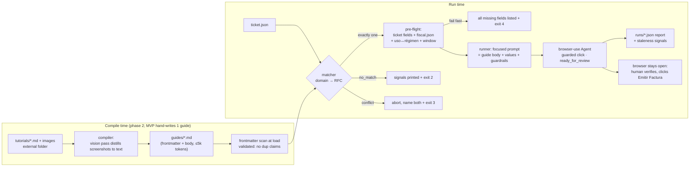

# ✨ feat: Agent-friendly invoicing guides with ticket→guide matching

## Overview

Turn the existing single-portal `invoice.py` experiment into a guide-driven CFDI invoicing system. A local folder of human markdown tutorials (with screenshots) covering hundreds of merchant invoicing portals gets compiled into compact, agent-friendly **playbooks** (one per portal, ≤5k tokens). Given a ticket JSON (like `data.json`), a deterministic **matcher** selects exactly one playbook, a **pre-flight** validates all required data before any browser opens, and a **runner** assembles a focused, low-context prompt for a browser-use agent that fills the portal form and **mechanically stops before the final submit** so a human verifies and clicks "Emitir Factura" themselves.

Ticket JSON extraction from physical receipts is **out of scope** (separate process). MVP proves the loop with one hand-written guide (Farmacia San Pablo, seeded from the 2026-06-12 live session); the tutorial→playbook compiler is phase 2.

## Enhancement Summary (deepen pass)

**Deepened on:** 2026-06-12. Inputs: full simplicity/YAGNI review, direct source verification of browser-use 0.12.9 internals, SAT catalog verification. (Architecture/security/python/performance/pattern/agent-native reviewers plus two skill-appliers were killed by a session limit — re-runnable later; their angles are partially covered by the original research pass.)

1. **Click-guard mechanism corrected (source-verified).** The originally proposed `Tools(exclude_actions=['click'])` would also block our *replacement* — registration skips any name in `exclude_actions` (`tools/registry/service.py:307`). Correct mechanism: plain decorator re-registration **overwrites** the built-in (dict assignment, no collision guard — `:321`). Separately, `evaluate` (raw JS) and `send_keys` (Enter-key submit) must be removed via `tools.exclude_action()`, and coordinate-clicking (which would bypass an index-based guard) is auto-enabled only for `claude-sonnet-4`/`claude-opus-4`/`gemini-3-pro` models (`agent/service.py:322-328`) — not our gpt family.
2. **New pre-flight rule from the SAT catalog.** Uso CFDI ↔ régimen compatibility: G03 is valid only with receptor regimens 601, 603, 606, 612, 620–626 — **not** 605 (sueldos) nor 616 (sin obligaciones). This explains the live session's "G03 absent from the dropdown" mystery and is now caught before any browser opens.
3. **Phase 1 slimmed ~25–30% (YAGNI review) with named re-entry points; safety stack untouched.** Deferred out of MVP: `index.json` artifact, `schema_version`, brand-alias tier, shared-domain markers, `gaps.jsonl`, flags/staleness machinery, `review_in_days`, the lockfile (replaced by a clear launch-failure message), `after_step` stop variant, real-tokenizer budget check, `source_tutorial`/`GUIDES_SOURCE_DIR`. Module split 7→5, with `guards.py` deliberately isolated as a small auditable safety surface. Sections below are amended in place; deferred items are marked with their re-entry point.

## Problem Statement / Motivation

A generic browser-use agent flails on Mexican facturación portals. Live evidence from the San Pablo session (2026-06-12, browser-use 0.12.9, gpt-5.4):

- The SPA renders **blank for ~20s**; the agent declared the portal "down" and quit (`Judge Verdict: ❌ FAIL`).
- The currency-masked Total input mangled `474.00` into `$74.00`, then `$74,474.00`; only JS + mask-event dispatch fixed it (3 wasted steps discovering this).
- The CP field is **disabled** until a hidden "Buscar cliente" lookup runs (`data-bind="enabled: isDisabledDomicilioFiscal"`).
- SAT validation surfaced as a cryptic JS alert: `{CFDI40147} - El campo DomicilioFiscalReceptor del receptor, debe encontrarse en la lista de RFC ins…` — a *data* problem the agent retried as a *navigation* problem.
- The Uso CFDI dropdown didn't offer G03 until Régimen Fiscal was selected first; régimen wasn't in `rfc.txt` at all.
- The run burned 13+ steps with loop-detection nudges and repeated malformed-JSON retries from the LLM.

Every portal has its own version of this jank. Rediscovering it per run is slow, expensive, and risky. We own the antidote — hundreds of human tutorials — but they're human-shaped (prose + screenshots), and dumping them all into context would drown the agent (context degradation measurably starts well below window limits).

External validation: this "compile prose SOPs into per-site playbooks, inject exactly one, gate irreversible actions in code" architecture is the convergent 2024–2026 industry pattern (Anthropic Agent Skills, Skyvern SOPs, browser-use's own workflow-use, Stagehand caching — see Sources).

## Proposed Solution



Three components, decided with the user (2026-06-12 refinement):

1. **Guide compilation** — tutorials live in a *local folder outside the repo*; images are *distilled to text at compile time* (vision pass → "expectations, not facts"; the live DOM stays authoritative). MVP: define the format + hand-write the San Pablo guide; automate in phase 2.
2. **Matching** — multi-signal because (user's words) "sometimes name is not relevant because they use one specific invoicing service and the url is included in the ticket, sometimes it's relevant because they have a custom implementation." Deterministic tiers, no embeddings.
3. **Focused runner** — exactly one guide in context per run; stop-before-submit enforced mechanically, not just in prose.

## Technical Approach

### 1. Guide format (`guides/<id>.md`)

YAML frontmatter is for machines (matcher, pre-flight, gate); markdown body is for the model. Target body ≤5k tokens (~500 lines), checked by a validator.

```yaml
---
id: farmacia-san-pablo
description: CFDI 4.0 self-invoicing on Farmacia San Pablo's portal (in-store tickets).
match:
  domains: [farmaciasanpablo.com.mx]       # normalized eTLD+1
  rfcs: [PPL961114GZ1]                     # issuer RFCs (canonical key)
portal_url: https://www.farmaciasanpablo.com.mx/electronic-billing
required_ticket_fields: [invoice_data.facturacion_folio, purchase.total]
required_fiscal_fields: [rfc, nombre, cp, regimen_fiscal, uso_cfdi, email]
invoicing_window: { max_days_after_purchase: 180 }   # pre-flight checks purchase.date
stop:
  before_labels: ["Emitir Factura", "Generar Factura y Enviar"]  # list; case/accent-insensitive
patience: { max_reload_cycles: 3, wait_seconds: 10 }  # bounded; then report portal_unreachable
last_verified: 2026-06-12
---
```

Every key above has a Phase 1 consumer. Deferred keys (deepen pass), each with its re-entry point: `schema_version` + `source_tutorial` ship in the same PR as the Phase 2 compiler; `brand_aliases` returns with the fuzzy/alias matching tier (Phase 2); subdomain/`shared` white-label keys arrive with the first white-label guide; `review_in_days` arrives with Phase 3 staleness automation; `stop.after_step` (for portals with no preview screen) is documented as a planned variant and implemented with the first such portal.

Body sections (fixed order, so the prompt position stays stable for KV-cache reuse):

1. **Preconditions** — data that must exist before starting.
2. **Steps** — numbered, imperative, each with a one-line verification ("the field must visually read `474.00` before submitting").
3. **Quirks** — table: symptom → workaround (workarounds reference *named runner actions*, never raw JS).
4. **Error codes** — table: portal/SAT message → meaning → action (`CFDI40147` → receptor data ≠ SAT registry → abort `aborted_error_code`, tell user to fix fiscal data; `ya facturado` → abort `already_invoiced`).
5. **Stop & completion criteria** — what screen means "done filling"; the human's next button, verbatim.

Screenshot-distilled facts use a documented soft-marker convention: `expected: the "Uso de CFDI" dropdown sits below Régimen Fiscal` — the agent is told live DOM wins over `expected:` lines.

### 2. Matcher (`cfdi/matcher.py`) over a frontmatter scan (`cfdi/guides.py`)

Pure function: `(ticket_signals, index) → MatchResult` where result is exactly one of `matched(guide_id, tier)`, `no_match(signals_seen)`, `conflict(candidates)`, `needs_rfc(shared_domain)`.

- **Signals** from ticket: `additional_info.invoice_url` (scheme-less tolerated), `issuer.rfc`. (`issuer.brand`/`legal_name` becomes a signal in Phase 2 with the alias tier.)
- **Tier 1 — domain**: normalize via public-suffix-aware parsing (`tldextract`; naive "last two labels" breaks on `.com.mx`), lowercase, strip `www.`.
- **Tier 2 — issuer RFC**: exact, verbatim. (RFC is legally mandatory on Mexican receipts, so this tier is near-universal.)
- **Cross-tier disagreement** (domain → guide A, RFC → guide B) = `conflict`: abort naming both. Never silently pick. Kept in MVP even though it cannot fire with one guide — it's the matcher's defining invariant (~10 lines in a pure function) and guide #2 must not ship without it.
- **Deferred (deepen pass)**: brand-alias tier 3 and fuzzy matching → Phase 2, behind interactive confirmation / `--yes-fuzzy` (escape hatch today: `--guide ID`). `shared: true` white-label domain markers + `needs_rfc` result variant → first white-label guide.
- **No `index.json` in MVP** (deepen pass): with up to ~100 guides, the matcher parses `guides/*.md` frontmatter directly at load (milliseconds) — same validation (required keys present, **no duplicate match-key claims**, referenced files exist) happens during the load-all scan, with no generated-artifact sync risk. The index as a committed artifact returns with the Phase 2 compiler, which builds one anyway.

### 3. Pre-flight (`cfdi/preflight.py`)

Runs after match, before any browser. Reports **all** problems at once, not first-only:

- Required ticket fields (per guide frontmatter, dotted paths into ticket JSON).
- Fiscal data: `fiscal.json` replaces free-form `rfc.txt` — schema: `{rfc, nombre, cp, regimen_fiscal: "612", uso_cfdi: "G03", email}`. A small static SAT catalog (a dict vendored inside `cfdi/preflight.py`; ~30 codes, sourced from SAT's published c_RegimenFiscal/c_UsoCFDI) maps names↔codes ("gastos en general" → G03) and validates: RFC pattern (12/13 alnum), CP (5 digits), email shape, codes exist in catalog.
- **Uso↔régimen compatibility (deepen pass, SAT-verified)**: each c_UsoCFDI code lists the receptor regimens it's valid with. G03 is valid only with 601, 603, 606, 612, 620, 621, 622, 623, 624, 625, 626 — **not** 605 (sueldos y salarios) nor 616 (sin obligaciones fiscales). Pre-flight rejects incompatible pairs with a message naming valid usos for the user's régimen. This is exactly why the live session saw G03 missing from the portal dropdown; now it's caught in <1s instead of mid-run. (Sources: [Anexo 20 c_UsoCFDI G03](http://www.gncys.com/anexo20/4.0/usocfdi/G03/), [régimen↔uso tables](https://exdoo.mx/blogs/uso-de-cfdi-dependiendo-el-regimen-fiscal/).)
- Ticket sanity: `purchase.total > 0`, purchase date not in future.
- Invoicing window: `purchase.date` within `invoicing_window` (San Pablo: 180 days) → else `preflight_failed` without opening a browser.
- Known gap surfaced immediately: current fiscal data lacks `regimen_fiscal` — **the first run intentionally fails pre-flight** with a message naming the field, the expected code format, and that SAT's Constancia de Situación Fiscal contains it.

### 4. Runner (`cfdi/runner.py` + `facturar.py` entry point)

Refactor seams already isolated in `invoice.py`: `build_task()` (prompt assembly, `invoice.py:32-101`) and `main()` (loading/browser/hold, `invoice.py:104-142`).

browser-use integration (every API verified against installed 0.12.9 source):

| Concern | Mechanism (verified) |
|---|---|
| Guide injection | Guide body + value-substituted field map into `task` (rendered as `<user_request>` atop every step; system prompt mandates following specific stepwise requests literally) — `agent/prompts.py:349-361` |
| Cross-merchant policy | `extend_system_message` (appended to cached system msg — stable, cheap) — `agent/service.py:171`, `prompts.py:55-56`. **Never** `message_context`: removed in 0.12, silently swallowed by `**kwargs` |
| Skip first LLM step | `initial_actions=[{'navigate': {'url': portal_url, 'new_tab': False}}]` — `service.py:149,459` |
| **Mechanical stop gate** | **(corrected in deepen pass — source-verified)** Register a custom action named `click` on a normal `Tools()` — registration is a plain dict assignment with no collision guard (`tools/registry/service.py:321`), so it **overwrites** the built-in. Do NOT use `exclude_actions=['click']`: the registry skips registering any name in that list, which would block our replacement too (`:307`). The guarded click reuses the stock param model (identical LLM-facing schema), resolves the element via `browser_session.get_element_by_index(index)` (`browser/session.py:2365`), checks text/aria-label/value against `stop.before_labels` (case/accent-folded) and **refuses** with `ActionResult(error="REFUSED: '<label>' is the final submit — call ready_for_review instead")`; clean clicks dispatch the same `ClickElementEvent` the built-in uses (`tools/service.py:706`). Layered with: prompt constraint + custom `ready_for_review` done-action (`ActionResult(is_done=True, success=True)`) + judge |
| **Bypass surface closed** | `tools.exclude_action('evaluate')` (raw JS could `form.submit()`; our bounded `set_masked_input` replaces its one legit use) and `tools.exclude_action('send_keys')` (Enter on a focused field submits forms; San Pablo needed it zero times — re-enable per-guide later if a portal requires special keys). Coordinate-clicking (would bypass an index-based guard) is auto-enabled only for `claude-sonnet-4`/`claude-opus-4`/`gemini-3-pro`/`browser-use/` models (`agent/service.py:322-328`) — inactive for our gpt family; if the model family ever changes, the runner must assert coordinate clicking is off. Residual accepted risk: exotic onchange-submit dropdowns (note in guide if ever seen) |
| Masked inputs | Custom `set_masked_input(index, digits)` action using injected `browser_session` → CDP `Runtime.evaluate` + mask-event dispatch (pattern of built-in `evaluate`, `tools/service.py:1777-1790`). Bounded: sets values on input elements only; guides reference it by name, never raw JS. (0.12.9's built-in `input` already *detects* post-type mismatch, `tools/service.py:804-810` — our action is the *fix*) |
| Correct judging | `use_judge=True` + `ground_truth` derived from the guide's stop/completion criteria ("form filled but NOT submitted; final button <label> visible and unclicked") — `service.py:182-184` (today's judge graded the wrong goal) |
| LLM flakiness | `fallback_llm=` second model (observed: gpt-5.4 emitted malformed `AgentOutput` JSON 4×; log line `service.py:2000`) |
| Step budget | `agent.run(max_steps=N)` from guide size (not a constructor param) |
| Report capture | `register_new_step_callback` (parsed model output per step) + `AgentHistoryList`: `final_result()`, `is_successful()`, `is_validated()`, `usage` (tokens by model) |
| Browser | `keep_alive=True`, per-portal profile `~/.config/browseruse/profiles/<guide-id>`, slow-SPA waits from guide `patience`. Concurrent same-portal runs: **no lockfile (deepen pass)** — Chrome already enforces profile exclusivity (that's what causes the `Failed to open a new tab` CDP error); the runner just catches the launch/connect failure and prints "another run has the <guide-id> profile open — close it first" (~3 lines, no PID state machine to mismanage) |

CLI contract: `uv run facturar.py <ticket.json> [--fiscal fiscal.json] [--guide ID] [--headless]`. Exit codes: 0 `ready_for_review`, 2 `no_match`, 3 `conflict`, 4 `preflight_failed`, 5 `aborted` (blocked/error-code), 6 `incomplete_max_steps`, 7 `judge_failed`. `HEADLESS` env semantics and `INVOICE_MODEL` override preserved.

### 5. Run report + staleness loop (`runs/`)

One JSON per run, gitignored, named `runs/<timestamp>-<guide-id>-<folio>.json`:

```json
{
  "status": "ready_for_review",
  "guide_id": "farmacia-san-pablo",
  "ticket": {"folio": "015103202606010060729", "total": 474.0},
  "final_url": "…", "human_next_button": "Emitir Factura",
  "fields_filled": {"rfc": "…", "total": "474.00"},
  "fields_empty": {}, "portal_errors_verbatim": [],
  "steps_taken": 9, "unmapped_errors": 0,
  "usage": {"total_tokens": 0, "by_model": {}}
}
```

Failure runs **also** produce reports (status from the enum above; agent's verbatim portal error text included so wrong-data / already-invoiced / expired can be distinguished). The report carries only the *free* staleness signals — `steps_taken` (from history) and `unmapped_errors` (a miss-counter on the error-code map). **Deferred (deepen pass):** `verification_mismatches` (requires a per-step verify-reporting protocol — real machinery hiding behind one JSON key), `runs/flags/` + thresholds + flagged-guide warnings (fleet monitoring for one interactively-watched guide; re-enters with Phase 3 staleness automation), and `runs/gaps.jsonl` (its only consumer is the Phase 2 authoring backlog; in Phase 1 the no-match path prints the signals and exits 2 — the terminal *is* the backlog). Reports are written with plain `json.dump`; atomic write-temp-rename returns when something machine-reads `runs/`.

### 6. Repo layout, config, hygiene

```
facturar.py            # CLI + orchestration: load → match → preflight → run; exit codes
cfdi/
  guides.py            # parse guides/*.md frontmatter+body; validate keys; reject dup
                       #   match claims at load; chars/4 token warning. (No index.json.)
  matcher.py           # pure: (signals, guides) → matched | no_match | conflict
  preflight.py         # dotted-path ticket fields; fiscal.json shape; vendored SAT
                       #   catalogs + uso↔régimen compatibility; invoicing window;
                       #   all errors at once
  guards.py            # guarded click + set_masked_input + ready_for_review —
                       #   isolated on purpose: the safety-critical surface stays
                       #   small and auditable
  runner.py            # prompt assembly (stable section order) + Agent wiring +
                       #   report json.dump into runs/
guides/farmacia-san-pablo.md   # committed
runs/                  # reports (gitignored)
tests/                 # pytest (uv add --dev pytest)
fiscal.json            # gitignored; fiscal.json.example committed
tickets/               # gitignored real tickets; examples/ticket.sample.json committed
invoice.py             # deleted the day the Phase 1 parity exit-criterion passes
```

(Deepen pass: 7 modules → 5. The split carves at the seam that matters — pure logic importable/testable without browser_use vs browser-coupled code — instead of by noun. `report.py` was `json.dump` of a payload `ready_for_review` already assembles; `prompt.py` and agent wiring are one concern; the SAT catalog is a dict only pre-flight reads.)

- New deps: `tldextract`, `pyyaml` (frontmatter), `pytest` (dev). All via `uv add`.
- `GUIDES_SOURCE_DIR` env (external tutorials folder) is **deferred to the Phase 2 compiler PR** — nothing in Phase 1 reads it; the San Pablo guide is seeded from the live session, not a tutorial.
- **PII fix**: `rfc.txt` (real RFC/name/email) and real `data.json` are currently committed — replace with gitignored real files + sanitized committed examples, mirroring `.env`/`.env.example`. (Git history rewrite is out of scope; note it.)

## System-Wide Impact

- **Interaction graph**: `facturar.py` → matcher (reads index) → pre-flight (reads fiscal.json + catalogs) → runner → browser-use Agent → guarded Tools actions → CDP/Chrome → report writer → flags/gaps. The guarded `click` wraps the framework's hottest action — a browser-use upgrade that changes click/Tools internals breaks us first there (pin `browser-use==0.12.9`; upgrade deliberately).
- **Error propagation**: every failure class maps to a typed status + exit code + report; agent-level errors (captcha, blocked field, mapped error code) abort the *run* but still write a report and keep the browser open for human takeover. Pre-browser failures (match/pre-flight) never launch Chrome.
- **State lifecycle risks**: no lockfile to mismanage (deepen pass) — Chrome's own profile lock is the source of truth; a killed run can leave the profile locked, so the launch-failure message must name the profile dir to clean. Reports are plain `json.dump` (atomicity deferred until something machine-reads `runs/`).
- **API surface parity**: `facturar.py` supersedes `invoice.py`; until parity AC passes, both exist but `invoice.py` gains a deprecation note. `main.py` (Show HN demo) untouched.
- **Integration test scenarios** (beyond unit tests): (1) matcher against fixture guides where domain → guide A but RFC → guide B — must return `conflict` naming both; (2) pre-flight against current real `fiscal` data missing régimen → must fail listing exactly that field; (3) guarded click against a local HTML fixture page containing an "Emitir Factura" button — action must refuse; (4) full prompt assembly snapshot for the San Pablo guide (golden-file, asserts guide body present and *only* that guide); (5) registry assertions after runner setup: exactly one `click` action and it's ours, `evaluate`/`send_keys` absent, coordinate clicking off.

## Implementation Phases

### Phase 1 — MVP: prove the loop on San Pablo

- Guide format spec + loader (`cfdi/guides.py`: frontmatter validation, dup-claim rejection at load, chars/4 budget warning).
- Hand-written `guides/farmacia-san-pablo.md` encoding every quirk from the live session (Appendix A).
- Matcher (tiers 1–2: domain + RFC, typed results, conflict abort; alias/fuzzy deferred).
- `fiscal.json` + vendored SAT catalogs + pre-flight (all-errors-at-once; uso↔régimen compatibility; invoicing window).
- Runner: focused prompt, guarded click (overwrite mechanism), `evaluate`/`send_keys` excluded, `set_masked_input`, `ready_for_review`, judge ground-truth, fallback_llm, profile-launch-failure message, report writer.
- Tests per conventions below; PII hygiene moves.
- **Exit criteria**: San Pablo E2E reaches the Emitir Factura screen with all fields filled, ≤10 steps, zero guard refusals triggered by the agent *attempting* the final button (and if attempted: refused + logged), report written, human submits manually.

### Phase 2 — Compiler + scale

- `compile_guides.py`: tutorial md + screenshots → vision-distilled playbook (structured extraction; verbatim labels cross-checked; `expected:` markers; batch API) → human review gate → index rebuild.
- Compile a starter set (~10 portals); small eval harness first (baseline vs playbook on ~5 janky portals — measure, don't assume; FlowBench's ~43% ceiling says playbooks help but aren't magic).
- Fuzzy + brand-alias tiers behind confirmation; `runs/gaps.jsonl` → authoring backlog.
- Re-entry of deferred MVP items (deepen pass): `index.json` artifact, `schema_version`, `source_tutorial`, `GUIDES_SOURCE_DIR`, real-tokenizer budget check — all in the compiler PR; `shared: true` white-label markers + `needs_rfc` with the first white-label guide; atomic report writes with the first machine consumer of `runs/`.

### Phase 3 — Hardening & leverage

- Per-merchant `domains=`-scoped custom actions (zero token cost off-portal — registry rebuilds the action schema per page URL).
- Staleness automation — this is where the deferred monitoring machinery re-enters: `runs/flags/`, mismatch thresholds, the per-step `verification_mismatches` protocol, `review_in_days` frontmatter + sweep, flagged-guide warnings. Deep-link support (guide opts into ticket `invoice_url` when it embeds the folio).
- Deterministic fast-path: cache successful trajectories keyed on DOM fingerprint, agent fallback on drift (Stagehand pattern) — only for consistently-green portals.
- Captcha/login pause-and-resume flow (keep_alive + `agent.pause()` means a human can solve and the agent continues — currently unspecified everywhere).

## Acceptance Criteria

Safety gate
- [ ] Guarded `click` refuses elements whose text/aria-label/value matches any `stop.before_labels` entry, case- and accent-insensitive; refusal is logged and surfaced in the report. Verified against a local HTML fixture.
- [ ] `stop.before_labels` (list) is implemented; the format spec documents `after_step: N` as the planned variant for no-preview portals (implementation deferred to the first such portal).
- [ ] `ready_for_review` payload contains: final URL, human's next button verbatim, fields filled (name→value), fields empty (name→reason), portal errors verbatim.

Matcher
- [ ] Pure function with table-driven tests covering: scheme-less URL, `.com.mx` eTLD+1, `www.` strip, RFC hit, cross-tier conflict, zero signals. Assertions are literal `assert result == MatchResult(...)` per repo testing conventions — no variables in expectations. (Shared-domain and alias cases land with their Phase 2 features.)
- [ ] Cross-tier conflict and same-tier double-claim never silently pick a winner (conflict aborts naming both; dup claims rejected at index build).
- [ ] No-match: exits before browser printing the signals seen, exit code 2. (`gaps.jsonl` deferred to Phase 2.)
- [ ] Registry safety assertions: after runner setup, exactly one `click` action exists and it is the guarded one; `evaluate` and `send_keys` are not in the registry; coordinate clicking is off.

Pre-flight
- [ ] Lists **all** missing/invalid fields in one message, naming file + expected key/format; exit code 4; verified by running against current fiscal data (must fail on missing `regimen_fiscal`).
- [ ] Validates RFC/CP/email/codes against the vendored SAT catalogs in `cfdi/preflight.py`; rejects incompatible uso↔régimen pairs (literal test: G03 + 605 → rejected naming the valid usos; G03 + 612 → passes); rejects out-of-window tickets (`invoicing_window`) without launching a browser.

Runner & report
- [ ] Prompt assembly golden test: contains the matched guide body and no other guide's content; guide section position stable across runs (cache-friendly), per-run values last.
- [ ] Judge `ground_truth` is built from the guide's stop/completion criteria, not a generic phrase.
- [ ] Every terminal state (incl. max_steps, judge-fail, abort) writes a JSON report with status from the defined enum; browser stays open for human takeover.
- [ ] Error-code map drives behavior: CFDI40147-class → abort with data-fix instructions, no retry; "ya facturado" → status `already_invoiced`.
- [ ] Bounded patience: after `patience.max_reload_cycles`, report `portal_unreachable` with screenshot — overriding any "never report down" phrasing.
- [ ] Concurrent same-portal run: launch/connect failure is caught and reported as "another run has the <guide-id> profile open — close it first" (naming the profile dir), instead of a raw `Failed to open a new tab` CDP error.

Format & hygiene
- [ ] Guide loader validates required frontmatter keys and rejects duplicate match-key claims across guides; warns when a body exceeds ~20k chars (chars/4 ≈ 5k-token heuristic — real tokenizer arrives with the compiler PR, as does `schema_version`).
- [ ] San Pablo guide body demonstrates: `expected:` convention, currency-mask quirk → `set_masked_input`, Buscar-cliente/disabled-CP quirk, régimen-before-UsoCFDI ordering, CFDI40147 + ya-facturado error map rows.
- [ ] Real `fiscal` data and tickets untracked (gitignored) with committed sanitized examples; `runs/` gitignored.

Testing conventions (repo + user standards)
- [ ] pytest via `uv add --dev pytest`; no stubs/mocks of our own classes — matcher/pre-flight/prompt tests run real objects on fixture files; only outbound HTTP would be mocked (none needed in MVP).
- [ ] Strong literal assertions: full-object equality (`assert report == {...literal...}`); where output has volatile keys (timestamps), slice and assert the full remaining dict so removals are caught.
- [ ] Fixture naming per convention (franchise roll: #11 Breaking Bad): e.g. `tests/fixtures/tickets/los_pollos_hermanos.json` (domain+RFC happy path), `madrigal_electromotive.json` (cross-tier conflict: domain → one guide, RFC → another), `lavanderia_brillante.json` (no-signals ticket).

## Success Metrics

Baseline = 2026-06-12 San Pablo session: first run judged FAIL (declared portal down); second run 13+ steps with loop nudges, 3 steps lost to the currency mask, 4 malformed-LLM-JSON retries, régimen gap discovered only at the portal.

- ≤10 steps to reach stop screen on San Pablo; zero loop-detection nudges.
- 0 final-submit clicks by the agent across all runs (guard refusals allowed, clicks not).
- Data gaps (régimen) caught at pre-flight in <1s, not minutes into a browser run.
- Guide body ≤5k tokens; total run tokens reported per run (`history.usage`) and trending down vs baseline.
- Time-to-first-guide for a new portal (phase 2): one compile + review cycle, no code changes.

## Dependencies & Risks

| Risk | Mitigation |
|---|---|
| browser-use API churn (guarded click wraps internals; `message_context` already vanished silently) | Pin `browser-use==0.12.9`; integration tests around Tools registration; upgrade deliberately |
| Portal redesigns rot guides (~half of live-site flows change within a year — WebCanvas) | Staleness counters per run + flags + `review_in_days`; every run is a probe |
| LLM output flakiness (observed with gpt-5.4) | `fallback_llm`; `max_failures` default keeps runs alive; report captures retry counts |
| Wrong-guide match on shared domains | `shared: true` index entries force RFC tier; conflicts abort; no fuzzy in MVP |
| VLM-distilled labels hallucinate (phase 2) | OCR cross-check, `expected:` soft markers, human review gate before a guide ships |
| SAT-side data mismatches can't be pre-validated offline | Error-code map turns them into actionable aborts, not retries |
| Stop gate bypass via non-click paths | **(deepen pass)** `evaluate` (raw JS) and `send_keys` (Enter-submit) excluded from the registry; `set_masked_input` is value-only; coordinate clicking verified inactive for gpt models (runner asserts it stays off); judge + human-watch as outer layers. Residual: exotic onchange-submit widgets — accept and document per-guide if ever seen |

## Appendix A — San Pablo compiled guide (format exemplar, seeds Phase 1)

Body sketch (full guide written in Phase 1; every line below is session-verified):

```markdown
## Preconditions
- ticket: invoice_data.facturacion_folio (21 digits), purchase.total
- fiscal: rfc, nombre, cp, regimen_fiscal, uso_cfdi=G03, email

## Steps
1. You start at the billing page (navigation is pre-done). If blank, apply patience policy.
   verify: a "Generar Factura" button is visible.
2. Click "Generar Factura" (entry to ticket capture — NOT a submit; the final button has a different label).
3. Fill "Folio" with {facturacion_folio}. verify: field shows all 21 digits.
4. Fill "Total" using action set_masked_input (digits only: "47400" for $474.00).
   verify: field visually reads exactly "474.00" / "$474.00" before continuing.
5. Click "Obtener Factura". On alert "No se encontró el recibo…": re-verify folio+total once; if it repeats, abort (wrong ticket data).
6. Fiscal form. Order matters: select Régimen Fiscal {regimen_fiscal} FIRST, then Uso de CFDI G03
   (expected: G03 absent from the dropdown until régimen is selected).
7. Fill RFC, nombre (exactly as written), email. The CP field is disabled until the "Buscar cliente" lookup runs
   (expected: lookup button near the RFC field).

## Quirks
| symptom | workaround |
| Total shows "$74.00" after typing | use set_masked_input, never type decimals |
| page blank >10s | patience policy: wait 10s, reload, max 3 cycles |
| promo popup on entry | close via X before anything |

## Error codes
| match | meaning | action |
| CFDI40147 | receptor name/CP/régimen ≠ SAT registry | abort aborted_error_code: tell user to match Constancia de Situación Fiscal |
| No se encontró el recibo | folio/total wrong | one re-verify, then abort |
| ya facturado / previamente facturado | already invoiced | abort already_invoiced |

## Stop
Final button: "Emitir Factura" — NEVER click. When everything above is filled and verified, call ready_for_review.
```

## Sources & References

### Internal
- Refactor seams: `invoice.py:32-101` (`build_task`), `invoice.py:104-142` (loading/browser/hold), profile convention `invoice.py:115`
- Matching signals in sample: `data.json:6` (issuer RFC), `data.json:58` (scheme-less invoice_url)
- HEADLESS semantics `main.py:10-12`; model override `invoice.py:29`; `.gitignore:44-45` (`.browser-use/`)
- browser-use 0.12.9 verified APIs: `agent/service.py:133-211` (constructor incl. `extend_system_message`:171, `fallback_llm`:181, `use_judge`:182), `agent/prompts.py:49-58,349-361` (injection points), `tools/registry/service.py:290-326` (custom actions), `tools/service.py:804-810` (input mismatch detection), `tools/service.py:1777-1790` (CDP evaluate pattern), `agent/views.py:595-929` (history API)
- Session evidence: run logs 2026-06-12 (`/tmp/bu_invoice.log`) — blank-SPA fail, mask mangling, CFDI40147, judge-goal mismatch

### External (research-verified 2026-06-12)
- Context/skills: [Anthropic effective context engineering](https://www.anthropic.com/engineering/effective-context-engineering-for-ai-agents) · [Agent Skills best practices](https://platform.claude.com/docs/en/agents-and-tools/agent-skills/best-practices) · [Context Rot](https://research.trychroma.com/context-rot) · [Manus KV-cache lessons](https://manus.im/blog/Context-Engineering-for-AI-Agents-Lessons-from-Building-Manus)
- Gates in code: [OpenAI Operator system card](https://cdn.openai.com/operator_system_card.pdf) (92% confirmation recall) · [LangGraph interrupts](https://docs.langchain.com/oss/python/langgraph/interrupts) · [Skyvern workflow blocks](https://www.skyvern.com/docs/workflows/workflow-blocks-details)
- Prior art: [Skyvern prompting guide](https://www.skyvern.com/docs/getting-started/prompting-guide) · [browser-use workflow-use](https://github.com/browser-use/workflow-use) (pre-production) · [Stagehand caching](https://www.browserbase.com/blog/stagehand-caching) · [FlowBench](https://arxiv.org/abs/2406.14884) (format matters; ~43% ceiling)
- Matching: [Anthropic Contextual Retrieval](https://www.anthropic.com/news/contextual-retrieval) (lexical beats embeddings for exact IDs) · [tldextract/PSL](https://github.com/john-kurkowski/tldextract)
- Drift & vision: [WebCanvas/Mind2Web-Live](https://arxiv.org/abs/2406.12373) (~50% flows change/yr) · [OCRBench v2](https://arxiv.org/abs/2501.00321) · [OmniParser](https://arxiv.org/abs/2408.00203)
- Avoid: llms.txt as consumer mechanism ([adoption analysis](https://ppc.land/llms-txt-adoption-stalls-as-major-ai-platforms-ignore-proposed-standard/)); rigid JSON step schemas as authored source; embeddings-first matching; prompt-only gates
